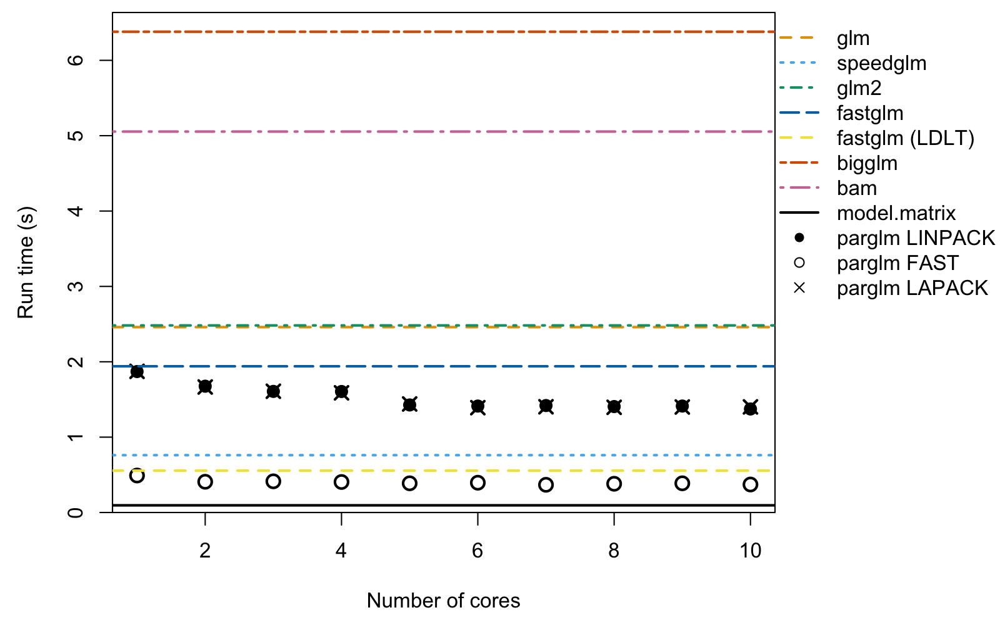

# Introduction to the parglm package

The motivation for the `parglm` package is a parallel version of the
`glm` function. It solves the iteratively re-weighted least squares
using a QR decomposition with column pivoting with the `DGEQP3` function
from LAPACK. The computation is done in parallel as in the `bam`
function in the `mgcv` package. The cost is an additional \\O(Mp^2 +
p^3)\\ where \\p\\ is the number of coefficients and \\M\\ is the number
of chunks to be computed in parallel. The advantage is that you do not
need to compile the package with an optimized BLAS or LAPACK which
supports multithreading. The package also includes a method that
computes the Fisher information and then solves the normal equation as
in the `speedglm` package. This is faster but less numerically stable.

## Example of computation time

Below, we estimate a logistic regression with 1000000 observations and
50 covariates. We vary the number of cores being used with the
`nthreads` argument to `parglm.control`. The `method` argument sets
which method is used. `LINPACK` uses the same pivoted QR (`dqrdc2`) as
`glm.fit` for the final decomposition; `LAPACK` uses `DGEQP3` from
LAPACK throughout; and `FAST` solves the normal equations from the
Fisher information, similar to the `speedglm` package.

``` r

#####
# simulate
n # number of observations
#> [1] 1000000
p # number of covariates
#> [1] 50
set.seed(68024947)
X <- matrix(rnorm(n * p, 1/p, 1/sqrt(p)), n, ncol = p)
df <- data.frame(y = 1/(1 + exp(-(rowSums(X) - 1))) > runif(n), X)
```

``` r

#####
# compute and measure time. Setup call to make
library(microbenchmark)
library(speedglm)
#> Loading required package: Matrix
#> Loading required package: MASS
#> Loading required package: biglm
#> Loading required package: DBI
library(fastglm)
library(glm2)
#> 
#> Attaching package: 'glm2'
#> The following object is masked from 'package:MASS':
#> 
#>     crabs
library(biglm)
library(mgcv)
#> Loading required package: nlme
#> This is mgcv 1.9-4. For overview type '?mgcv'.
#> 
#> Attaching package: 'mgcv'
#> The following object is masked from 'package:fastglm':
#> 
#>     negbin
library(parglm)
X_mat <- model.matrix(y ~ ., df)
biglm_form <- reformulate(names(df)[-1], response = "y")
bam_form   <- biglm_form
cl <- list(
  quote(microbenchmark),
  glm      = quote(glm     (y ~ ., binomial(), df)),
  speedglm = quote(speedglm(y ~ ., family = binomial(), data = df)),
  glm2     = quote(glm2    (y ~ ., binomial(), df)),
  fastglm  = quote(fastglm (X_mat, as.numeric(df$y), family = binomial())),
  fastglm3 = quote(fastglm (X_mat, as.numeric(df$y), family = binomial(), method = 3L)),
  bigglm   = quote(bigglm  (biglm_form, df, family = binomial())),
  bam      = quote(bam     (bam_form, family = binomial(), data = df)),
  times = 11L)
tfunc <- function(method = "LINPACK", nthreads)
  parglm(y ~ ., binomial(), df, control = parglm.control(method = method,
                                                         nthreads = nthreads))
cl <- c(
  cl, lapply(1:n_threads, function(i) bquote(tfunc(nthreads = .(i)))))
names(cl)[10:(10L + n_threads - 1L)] <- paste0("parglm-LINPACK-", 1:n_threads)

cl <- c(
  cl, lapply(1:n_threads, function(i) bquote(tfunc(
    nthreads = .(i), method = "FAST"))))
names(cl)[(10L + n_threads):(10L + 2L * n_threads - 1L)] <-
  paste0("parglm-FAST-", 1:n_threads)

cl <- c(
  cl, lapply(1:n_threads, function(i) bquote(tfunc(
    nthreads = .(i), method = "LAPACK"))))
names(cl)[(10L + 2L * n_threads):(10L + 3L * n_threads - 1L)] <-
  paste0("parglm-LAPACK-", 1:n_threads)

cl <- as.call(cl)
cl # the call we make
#> microbenchmark(glm = glm(y ~ ., binomial(), df), speedglm = speedglm(y ~ 
#>     ., family = binomial(), data = df), glm2 = glm2(y ~ ., binomial(), 
#>     df), fastglm = fastglm(X_mat, as.numeric(df$y), family = binomial()), 
#>     fastglm3 = fastglm(X_mat, as.numeric(df$y), family = binomial(), 
#>         method = 3L), bigglm = bigglm(biglm_form, df, family = binomial()), 
#>     bam = bam(bam_form, family = binomial(), data = df), times = 11L, 
#>     `parglm-LINPACK-1` = tfunc(nthreads = 1L), `parglm-LINPACK-2` = tfunc(nthreads = 2L), 
#>     `parglm-LINPACK-3` = tfunc(nthreads = 3L), `parglm-LINPACK-4` = tfunc(nthreads = 4L), 
#>     `parglm-LINPACK-5` = tfunc(nthreads = 5L), `parglm-LINPACK-6` = tfunc(nthreads = 6L), 
#>     `parglm-LINPACK-7` = tfunc(nthreads = 7L), `parglm-LINPACK-8` = tfunc(nthreads = 8L), 
#>     `parglm-LINPACK-9` = tfunc(nthreads = 9L), `parglm-LINPACK-10` = tfunc(nthreads = 10L), 
#>     `parglm-FAST-1` = tfunc(nthreads = 1L, method = "FAST"), 
#>     `parglm-FAST-2` = tfunc(nthreads = 2L, method = "FAST"), 
#>     `parglm-FAST-3` = tfunc(nthreads = 3L, method = "FAST"), 
#>     `parglm-FAST-4` = tfunc(nthreads = 4L, method = "FAST"), 
#>     `parglm-FAST-5` = tfunc(nthreads = 5L, method = "FAST"), 
#>     `parglm-FAST-6` = tfunc(nthreads = 6L, method = "FAST"), 
#>     `parglm-FAST-7` = tfunc(nthreads = 7L, method = "FAST"), 
#>     `parglm-FAST-8` = tfunc(nthreads = 8L, method = "FAST"), 
#>     `parglm-FAST-9` = tfunc(nthreads = 9L, method = "FAST"), 
#>     `parglm-FAST-10` = tfunc(nthreads = 10L, method = "FAST"), 
#>     `parglm-LAPACK-1` = tfunc(nthreads = 1L, method = "LAPACK"), 
#>     `parglm-LAPACK-2` = tfunc(nthreads = 2L, method = "LAPACK"), 
#>     `parglm-LAPACK-3` = tfunc(nthreads = 3L, method = "LAPACK"), 
#>     `parglm-LAPACK-4` = tfunc(nthreads = 4L, method = "LAPACK"), 
#>     `parglm-LAPACK-5` = tfunc(nthreads = 5L, method = "LAPACK"), 
#>     `parglm-LAPACK-6` = tfunc(nthreads = 6L, method = "LAPACK"), 
#>     `parglm-LAPACK-7` = tfunc(nthreads = 7L, method = "LAPACK"), 
#>     `parglm-LAPACK-8` = tfunc(nthreads = 8L, method = "LAPACK"), 
#>     `parglm-LAPACK-9` = tfunc(nthreads = 9L, method = "LAPACK"), 
#>     `parglm-LAPACK-10` = tfunc(nthreads = 10L, method = "LAPACK"))

out <- eval(cl)
#> Warning in microbenchmark(glm = glm(y ~ ., binomial(), df), speedglm =
#> speedglm(y ~ : less accurate nanosecond times to avoid potential integer
#> overflows
```

``` r

s <- summary(out) # result from `microbenchmark`
print(s[, c("expr", "min", "mean", "median", "max")], digits  = 3,
      row.names = FALSE)
#>               expr  min mean median  max
#>                glm 2404 2480   2460 2663
#>           speedglm  725  787    761 1065
#>               glm2 2427 2526   2482 2976
#>            fastglm 1895 1992   1940 2162
#>           fastglm3  547  558    555  585
#>             bigglm 6173 6416   6379 7011
#>                bam 4906 5067   5055 5340
#>   parglm-LINPACK-1 1825 1879   1870 1963
#>   parglm-LINPACK-2 1646 1704   1676 1832
#>   parglm-LINPACK-3 1569 1608   1607 1648
#>   parglm-LINPACK-4 1560 1611   1605 1743
#>   parglm-LINPACK-5 1397 1439   1427 1537
#>   parglm-LINPACK-6 1398 1421   1412 1471
#>   parglm-LINPACK-7 1379 1473   1419 1713
#>   parglm-LINPACK-8 1356 1457   1406 1846
#>   parglm-LINPACK-9 1382 1418   1413 1465
#>  parglm-LINPACK-10 1347 1372   1374 1393
#>      parglm-FAST-1  449  510    491  592
#>      parglm-FAST-2  387  414    408  488
#>      parglm-FAST-3  372  414    414  460
#>      parglm-FAST-4  367  423    405  527
#>      parglm-FAST-5  381  431    387  675
#>      parglm-FAST-6  348  413    395  584
#>      parglm-FAST-7  347  374    368  406
#>      parglm-FAST-8  348  393    381  454
#>      parglm-FAST-9  348  407    387  556
#>     parglm-FAST-10  338  373    372  440
#>    parglm-LAPACK-1 1825 1885   1873 2058
#>    parglm-LAPACK-2 1646 1670   1665 1733
#>    parglm-LAPACK-3 1586 1617   1609 1685
#>    parglm-LAPACK-4 1557 1598   1588 1676
#>    parglm-LAPACK-5 1390 1444   1440 1580
#>    parglm-LAPACK-6 1378 1399   1391 1451
#>    parglm-LAPACK-7 1368 1411   1403 1489
#>    parglm-LAPACK-8 1376 1403   1396 1475
#>    parglm-LAPACK-9 1365 1420   1400 1597
#>   parglm-LAPACK-10 1363 1413   1401 1507
```

The plot below shows median run times versus the number of cores.
Coloured horizontal lines show the single-threaded reference times for
`glm`, `speedglm`, `glm2`, `fastglm`, `bigglm`, and `bam`. We could have
used `glm.fit` and `parglm.fit`. This would make the relative difference
bigger as both call e.g., `model.matrix` and `model.frame` which do take
some time. To show this point, we first compute how much time this takes
and then we make the plot. The black solid line is the computation time
of `model.matrix` and `model.frame`.

``` r

modmat_time <- microbenchmark(
  modmat_time = {
    mf <- model.frame(y ~ ., df); model.matrix(terms(mf), mf)
  }, times = 10)
modmat_time # time taken by `model.matrix` and `model.frame`
#> Unit: milliseconds
#>         expr       min        lq       mean    median         uq        max
#>  modmat_time 75.486453 93.180659 98.3097262 95.229306 112.323805 121.203257
#>  neval
#>     10
```

``` r

par(mar = c(4.5, 4.5, .5, 9))
o <- aggregate(time ~ expr, out, median)[, 2] / 10^9
ylim <- range(o, 0); ylim[2] <- ylim[2] + .04 * diff(ylim)

o_linpack <- o[8L:(n_threads + 7L)]
o_fast    <- o[(n_threads + 8L):(2L * n_threads + 7L)]
o_lapack  <- o[(2L * n_threads + 8L):(3L * n_threads + 7L)]

ref_cols <- c("#E69F00", "#56B4E9", "#009E73", "#0072B2", "#F0E442", "#D55E00", "#CC79A7")
ref_lty  <- c("dashed", "dotted", "dotdash", "longdash", "44", "twodash", "1373")

plot(1:n_threads, o_linpack, xlab = "Number of cores", yaxs = "i",
     ylim = ylim, ylab = "Run time (s)", pch = 16, cex = 1.4)
points(1:n_threads, o_fast,   pch = 1, cex = 1.4, lwd = 2)
points(1:n_threads, o_lapack, pch = 4, cex = 1.4, lwd = 2)
for (i in 1:7)
  abline(h = o[i], lty = ref_lty[i], col = ref_cols[i], lwd = 2)
abline(h = median(modmat_time$time) / 10^9, lty = "solid", col = "black",
       lwd = 2)
usr <- par("usr")
par(xpd = TRUE)
legend(x = usr[2], y = usr[4], xjust = 0, yjust = 1,
       legend = c("glm", "speedglm", "glm2", "fastglm", "fastglm (LDLT)",
                  "bigglm", "bam", "model.matrix", "parglm LINPACK",
                  "parglm FAST", "parglm LAPACK"),
       lty = c(ref_lty, "solid", NA, NA, NA),
       lwd = c(2, 2, 2, 2, 2, 2, 2, 2, NA, NA, NA),
       col = c(ref_cols, "black", "black", "black", "black"),
       pch = c(NA, NA, NA, NA, NA, NA, NA, NA, 16, 1, 4),
       bty = "n")
```



Plot of runtime versus number of cores.

The open circles are the `FAST` method and the filled circles are the
`LINPACK` method. The `FAST` method, `speedglm`, `fastglm`, and
`fastglm` (LDLT) all compute the Fisher information and solve the normal
equation; `fastglm` (LDLT) uses an LDLT Cholesky decomposition (method
3) rather than the default column-pivoted QR (method 0). This is an
advantage in terms of computation cost but may lead to unstable
solutions. You can alter the number of observations in each parallel
chunk with the `block_size` argument of `parglm.control`.

The single-threaded performance of `parglm` may be slower when there are
more coefficients. The cause seems to be the difference between the
LAPACK and LINPACK implementation. This is presumably due to either the
QR decomposition method and/or the `qr.qty` method. On Windows, `parglm`
does seem slower when built with `Rtools` and the reason seems to be the
`qr.qty` method in LAPACK, `dormqr`, which is slower than the LINPACK
method, `dqrsl`. Below is an illustration of the computation times on
this machine.

``` r

qr1 <- qr(X)
qr2 <- qr(X, LAPACK = TRUE)
microbenchmark::microbenchmark(
  `qr LINPACK`     = qr(X),
  `qr LAPACK`      = qr(X, LAPACK = TRUE),
  `qr.qty LINPACK` = qr.qty(qr1, df$y),
  `qr.qty LAPACK`  = qr.qty(qr2, df$y),
  times = 11)
#> Unit: milliseconds
#>            expr        min          lq        mean     median          uq
#>      qr LINPACK 405.653672 417.4386915 423.2286798 418.273882 419.5840165
#>       qr LAPACK 366.584813 368.9630590 378.3611275 371.411456 381.3625660
#>  qr.qty LINPACK  45.758993  49.6602865  97.6999660  56.960808  84.8598935
#>   qr.qty LAPACK 110.668717 110.8921875 116.2642069 111.939102 114.2420515
#>         max neval
#>  474.846625    11
#>  403.544468    11
#>  401.498322    11
#>  155.756827    11
```

## Smaller datasets

For smaller datasets the per-call overhead of `parglm`’s thread pool can
exceed the gains from parallelism. Below we repeat the benchmark for
`n = 100,000` and `n = 10,000`, dropping `bam` since it is aimed at much
larger problems. Note the default `block_size` of `parglm.control` is
`10000`, so when `n = 10,000` the work cannot be split further across
threads and `parglm` effectively runs single-threaded regardless of
`nthreads`.

### n = 100,000

``` r

invisible(run_and_plot(n = 100000L, p = 50L, n_threads = n_threads))
#>               expr   min  mean median   max
#>                glm 167.5 172.2  171.7 183.0
#>           speedglm  64.1  71.4   68.2 106.7
#>               glm2 170.6 194.5  174.0 290.1
#>            fastglm 165.0 168.5  165.4 175.8
#>     fastglm (LDLT)  53.7  54.9   54.2  56.9
#>             bigglm 634.7 684.7  649.9 812.6
#>   parglm-LINPACK-1 140.7 145.6  143.9 161.3
#>   parglm-LINPACK-2 116.6 119.7  119.4 125.3
#>   parglm-LINPACK-3 108.9 111.3  110.5 115.0
#>   parglm-LINPACK-4 104.7 107.8  106.8 113.4
#>   parglm-LINPACK-5  89.6  92.1   91.7  96.8
#>   parglm-LINPACK-6  81.8  84.8   84.3  89.5
#>   parglm-LINPACK-7  75.7  78.6   76.7  88.5
#>   parglm-LINPACK-8  69.4  72.5   72.1  77.2
#>   parglm-LINPACK-9  67.1  70.4   69.0  86.9
#>  parglm-LINPACK-10  66.1  68.3   67.0  77.0
#>      parglm-FAST-1  39.0  40.1   39.8  41.5
#>      parglm-FAST-2  34.8  39.0   35.6  61.5
#>      parglm-FAST-3  33.6  34.8   34.0  40.6
#>      parglm-FAST-4  33.3  35.3   33.8  44.2
#>      parglm-FAST-5  31.9  35.8   32.4  55.8
#>      parglm-FAST-6  31.6  33.4   32.1  39.7
#>      parglm-FAST-7  31.5  32.5   31.8  35.5
#>      parglm-FAST-8  31.4  33.2   31.7  38.8
#>      parglm-FAST-9  30.7  31.5   31.3  33.3
#>     parglm-FAST-10  30.9  33.5   32.3  45.3
#>    parglm-LAPACK-1 141.4 143.0  142.7 145.5
#>    parglm-LAPACK-2 117.1 119.2  118.1 124.2
#>    parglm-LAPACK-3 109.7 111.8  110.5 116.5
#>    parglm-LAPACK-4 106.5 112.7  108.4 140.4
#>    parglm-LAPACK-5  90.1  93.7   92.8  99.8
#>    parglm-LAPACK-6  81.8  84.5   85.0  87.7
#>    parglm-LAPACK-7  75.3  78.2   77.0  91.7
#>    parglm-LAPACK-8  68.4  73.6   72.1  92.8
#>    parglm-LAPACK-9  66.4  70.3   69.0  87.1
#>   parglm-LAPACK-10  65.8  68.9   67.7  75.7
```


Plot of runtime versus number of cores for n = 100,000.

### n = 10,000

``` r

invisible(run_and_plot(n = 10000L, p = 50L, n_threads = n_threads))
#>               expr   min  mean median   max
#>                glm 14.64 16.61  15.22 31.62
#>           speedglm  6.87  7.58   7.70  8.00
#>               glm2 14.59 15.43  15.52 15.93
#>            fastglm 15.04 15.46  15.53 15.68
#>     fastglm (LDLT)  5.16  5.27   5.27  5.36
#>             bigglm 52.27 53.49  52.66 60.58
#>   parglm-LINPACK-1 15.04 15.62  15.60 16.40
#>   parglm-LINPACK-2 11.18 11.53  11.54 11.91
#>   parglm-LINPACK-3  9.78 10.68   9.94 17.19
#>   parglm-LINPACK-4  8.83  9.37   9.52  9.85
#>   parglm-LINPACK-5  8.83  9.11   9.13  9.43
#>   parglm-LINPACK-6  8.98  9.15   9.06  9.43
#>   parglm-LINPACK-7  8.33  8.59   8.57  8.85
#>   parglm-LINPACK-8  8.31  8.43   8.38  8.71
#>   parglm-LINPACK-9  8.26  8.49   8.49  8.74
#>  parglm-LINPACK-10  8.20  8.48   8.42  8.99
#>      parglm-FAST-1  4.43  4.67   4.63  4.99
#>      parglm-FAST-2  4.08  4.26   4.25  4.50
#>      parglm-FAST-3  4.01  4.17   4.15  4.42
#>      parglm-FAST-4  4.06  4.19   4.19  4.35
#>      parglm-FAST-5  4.02  4.25   4.25  4.51
#>      parglm-FAST-6  4.20  4.27   4.27  4.39
#>      parglm-FAST-7  4.20  4.28   4.28  4.46
#>      parglm-FAST-8  4.20  4.31   4.27  4.68
#>      parglm-FAST-9  4.19  5.12   4.31 13.06
#>     parglm-FAST-10  4.20  4.29   4.29  4.40
#>    parglm-LAPACK-1 15.20 15.76  15.85 16.37
#>    parglm-LAPACK-2 10.73 11.45  11.59 11.89
#>    parglm-LAPACK-3  9.74 10.11  10.11 10.60
#>    parglm-LAPACK-4  9.00  9.40   9.41  9.68
#>    parglm-LAPACK-5  8.76  9.13   9.11  9.61
#>    parglm-LAPACK-6  8.79  9.08   9.11  9.42
#>    parglm-LAPACK-7  8.16  8.43   8.42  8.80
#>    parglm-LAPACK-8  7.92  8.23   8.24  8.69
#>    parglm-LAPACK-9  7.86  8.02   8.01  8.17
#>   parglm-LAPACK-10  7.71  7.81   7.82  7.97
```


Plot of runtime versus number of cores for n = 10,000.

## Varying the number of coefficients

The per-row cost of each method scales roughly with \\p^2\\ (computing
\\X'WX\\ at each IRLS iteration), while parglm’s thread-pool overhead is
roughly fixed per call. The two effects compete: with small \\p\\ the
overhead dominates the parallel benefit, while with larger \\p\\ the
parallel work amortizes the overhead and parglm pulls ahead. Below we
contrast `n = 100,000, p = 5` (where the overhead wins) with
`n = 1,000,000, p = 20` (where the parallel work wins).

### n = 100,000, p = 5

``` r

invisible(run_and_plot(n = 100000L, p = 5L, n_threads = n_threads))
#>               expr  min mean median  max
#>                glm 40.3 41.6   40.8 46.3
#>           speedglm 29.4 30.1   29.9 32.9
#>               glm2 42.3 43.2   42.8 45.4
#>            fastglm 19.1 19.5   19.4 21.3
#>     fastglm (LDLT) 16.0 16.7   16.4 19.9
#>             bigglm 76.6 77.3   77.2 78.0
#>   parglm-LINPACK-1 26.3 27.1   26.8 30.6
#>   parglm-LINPACK-2 21.5 21.6   21.6 21.9
#>   parglm-LINPACK-3 19.4 20.1   19.8 24.0
#>   parglm-LINPACK-4 18.7 18.9   18.9 19.3
#>   parglm-LINPACK-5 18.9 19.1   19.0 20.2
#>   parglm-LINPACK-6 18.5 18.8   18.6 20.7
#>   parglm-LINPACK-7 18.2 18.8   18.4 22.3
#>   parglm-LINPACK-8 17.9 18.5   18.2 20.0
#>   parglm-LINPACK-9 17.8 18.2   18.2 18.5
#>  parglm-LINPACK-10 18.1 18.9   18.2 22.6
#>      parglm-FAST-1 24.0 24.8   24.5 26.4
#>      parglm-FAST-2 19.4 19.9   19.8 20.3
#>      parglm-FAST-3 18.3 18.6   18.6 18.9
#>      parglm-FAST-4 17.7 18.1   18.0 19.4
#>      parglm-FAST-5 18.1 18.8   18.3 22.6
#>      parglm-FAST-6 17.7 17.9   17.8 19.5
#>      parglm-FAST-7 17.2 17.7   17.7 18.2
#>      parglm-FAST-8 17.1 18.5   17.4 28.0
#>      parglm-FAST-9 17.4 17.8   17.7 19.3
#>     parglm-FAST-10 17.1 17.7   17.7 18.8
#>    parglm-LAPACK-1 26.3 26.6   26.6 27.3
#>    parglm-LAPACK-2 21.3 21.6   21.6 22.4
#>    parglm-LAPACK-3 19.5 20.0   19.8 21.5
#>    parglm-LAPACK-4 18.7 19.0   19.1 19.4
#>    parglm-LAPACK-5 18.8 19.3   19.0 21.0
#>    parglm-LAPACK-6 18.5 18.9   18.7 20.5
#>    parglm-LAPACK-7 18.3 18.5   18.5 18.7
#>    parglm-LAPACK-8 17.8 18.4   18.3 20.2
#>    parglm-LAPACK-9 17.7 18.2   18.3 18.5
#>   parglm-LAPACK-10 17.8 18.1   18.1 18.5
```


Plot of runtime versus number of cores for n = 100,000 and p = 5.

### n = 1,000,000, p = 20

``` r

invisible(run_and_plot(n = 1000000L, p = 20L, n_threads = n_threads))
#>               expr  min mean median  max
#>                glm  932  958    957  989
#>           speedglm  497  541    546  566
#>               glm2  983 1015   1015 1050
#>            fastglm  530  557    534  645
#>     fastglm (LDLT)  259  271    271  289
#>             bigglm 2499 2544   2548 2619
#>   parglm-LINPACK-1  557  565    564  581
#>   parglm-LINPACK-2  473  491    488  509
#>   parglm-LINPACK-3  457  469    464  493
#>   parglm-LINPACK-4  442  470    455  580
#>   parglm-LINPACK-5  420  439    426  511
#>   parglm-LINPACK-6  421  444    434  520
#>   parglm-LINPACK-7  414  433    431  455
#>   parglm-LINPACK-8  412  439    435  484
#>   parglm-LINPACK-9  409  429    416  498
#>  parglm-LINPACK-10  401  423    409  514
#>      parglm-FAST-1  361  391    382  505
#>      parglm-FAST-2  301  321    320  388
#>      parglm-FAST-3  275  293    286  340
#>      parglm-FAST-4  269  289    282  314
#>      parglm-FAST-5  265  284    283  302
#>      parglm-FAST-6  261  296    292  380
#>      parglm-FAST-7  264  275    272  302
#>      parglm-FAST-8  258  286    273  370
#>      parglm-FAST-9  258  276    267  313
#>     parglm-FAST-10  259  273    271  295
#>    parglm-LAPACK-1  555  577    570  661
#>    parglm-LAPACK-2  465  493    492  563
#>    parglm-LAPACK-3  454  474    474  498
#>    parglm-LAPACK-4  444  469    461  538
#>    parglm-LAPACK-5  420  435    438  452
#>    parglm-LAPACK-6  416  437    429  478
#>    parglm-LAPACK-7  407  438    428  510
#>    parglm-LAPACK-8  413  449    442  513
#>    parglm-LAPACK-9  409  423    419  443
#>   parglm-LAPACK-10  399  440    425  512
```


Plot of runtime versus number of cores for n = 1,000,000 and p = 20.

## Session info

``` r

sessionInfo()
#> R version 4.6.0 (2026-04-24)
#> Platform: aarch64-apple-darwin23
#> Running under: macOS Tahoe 26.5
#> 
#> Matrix products: default
#> BLAS:   /System/Library/Frameworks/Accelerate.framework/Versions/A/Frameworks/vecLib.framework/Versions/A/libBLAS.dylib 
#> LAPACK: /Library/Frameworks/R.framework/Versions/4.6/Resources/lib/libRlapack.dylib;  LAPACK version 3.12.1
#> 
#> locale:
#> [1] C.UTF-8/C.UTF-8/C.UTF-8/C/C.UTF-8/C.UTF-8
#> 
#> time zone: Europe/London
#> tzcode source: internal
#> 
#> attached base packages:
#> [1] stats     graphics  grDevices utils     datasets  methods   base     
#> 
#> other attached packages:
#>  [1] parglm_0.1.9         mgcv_1.9-4           nlme_3.1-169        
#>  [4] glm2_1.2.1           fastglm_0.1.0        speedglm_0.3-5      
#>  [7] biglm_0.9-3          DBI_1.3.0            MASS_7.3-65         
#> [10] Matrix_1.7-5         microbenchmark_1.5.0
#> 
#> loaded via a namespace (and not attached):
#>  [1] cli_3.6.6           knitr_1.51          rlang_1.2.0        
#>  [4] xfun_0.57           otel_0.2.0          zoo_1.8-15         
#>  [7] bigmemory_4.6.4     grid_4.6.0          evaluate_1.0.5     
#> [10] bigmemory.sri_0.1.8 compiler_4.6.0      codetools_0.2-20   
#> [13] sandwich_3.1-1      Rcpp_1.1.1-1.1      lattice_0.22-9     
#> [16] digest_0.6.39       parallel_4.6.0      splines_4.6.0      
#> [19] uuid_1.2-2          tools_4.6.0
```
