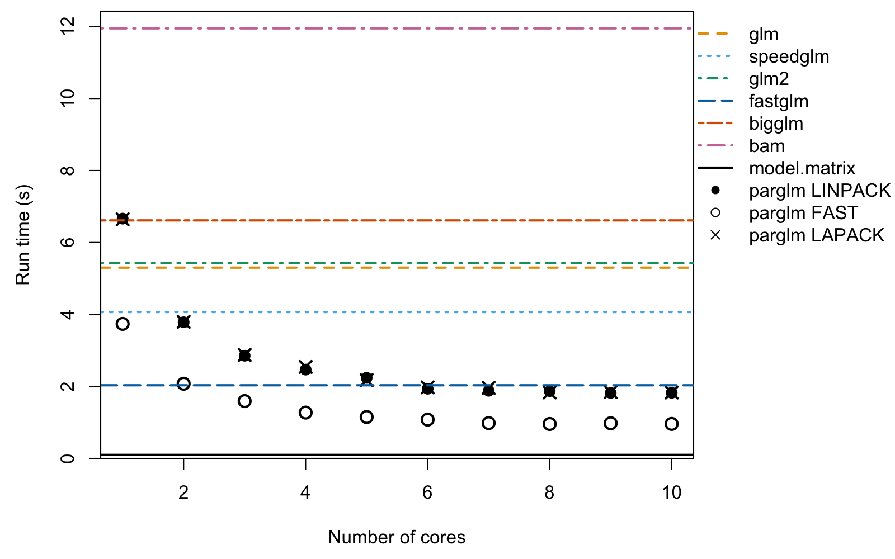
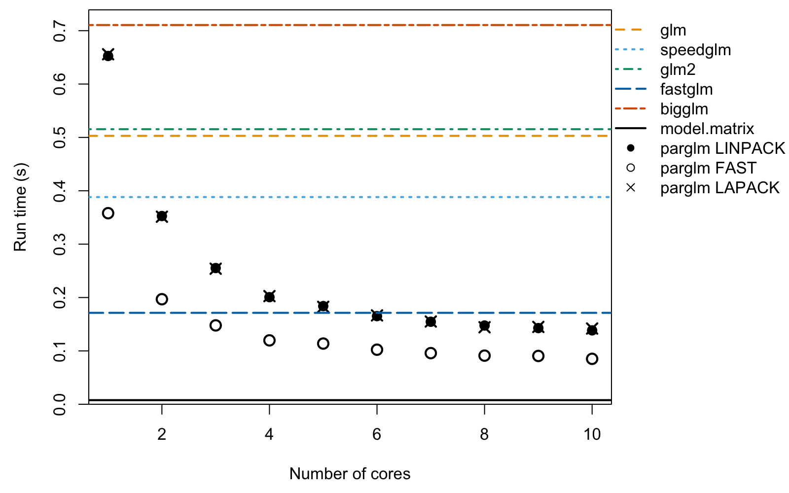
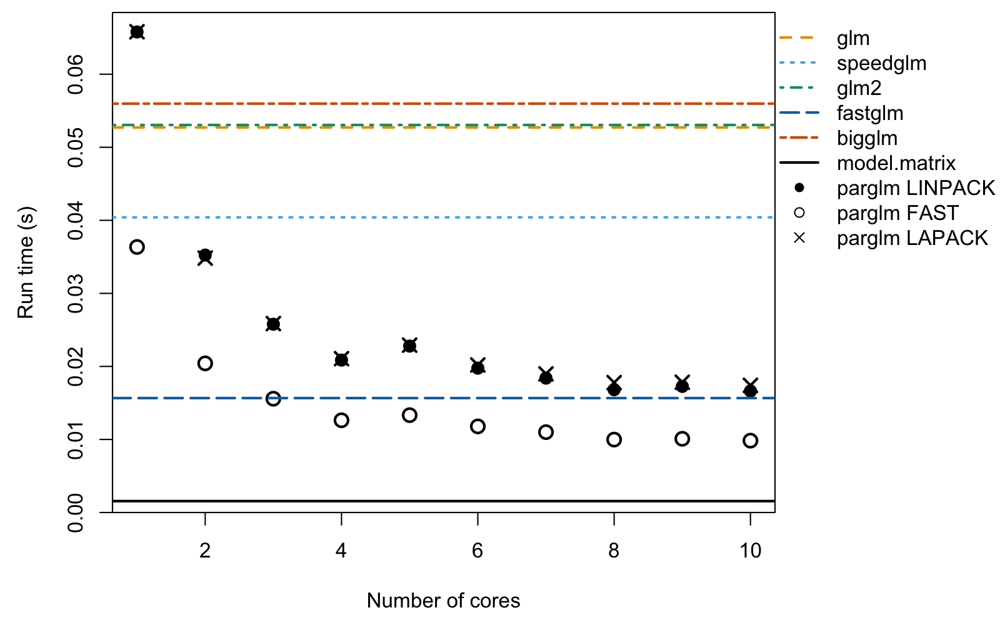
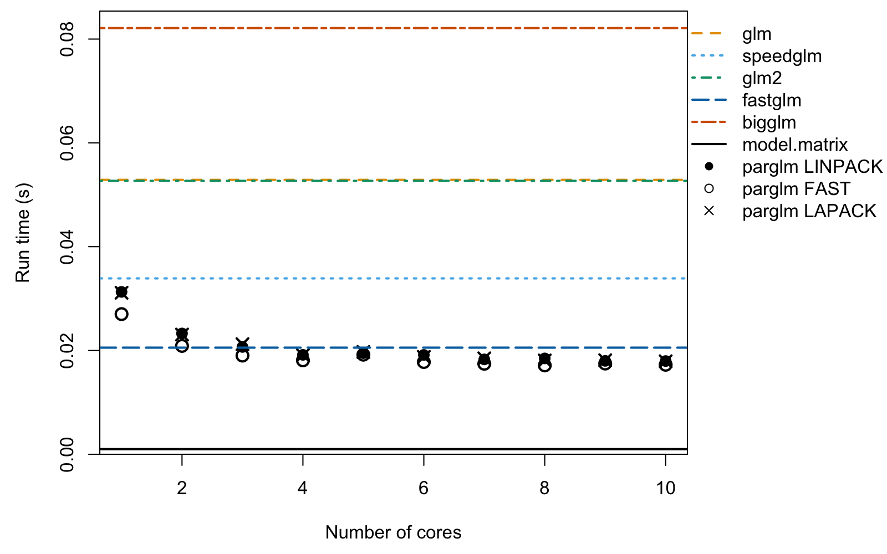
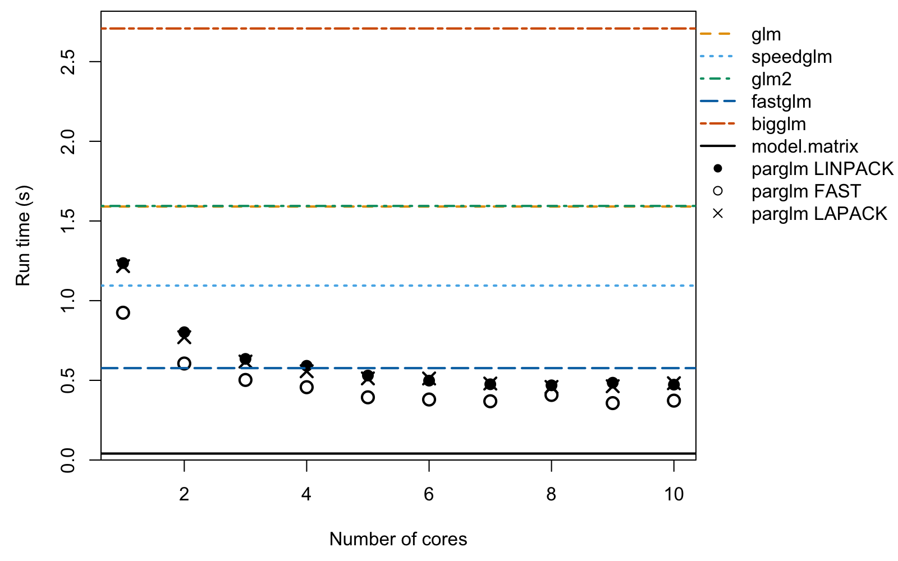

The motivation for the `parglm` package is a parallel version of the `glm`
function. It solves the iteratively re-weighted least squares using a QR
decomposition with column pivoting with `DGEQP3` function from LAPACK.
The computation is done in parallel as in the `bam` function in the `mgcv` package. The
cost is an additional $O(Mp^2 + p^3)$ where $p$ is the number of
coefficients and $M$ is the number chunks to be computed in parallel.
The advantage is that you do not need to compile the package with
an optimized BLAS or LAPACK which supports multithreading. The package also
includes a method that computes the Fisher information and then solves the normal
equation as in the `speedglm` package. This is faster but less numerically
stable.

## Example of computation time


Below, we estimate a logistic regression with 1000000 observations
and 50 covariates. We vary the number of cores being used with the
`nthreads` argument to `parglm.control`. The `method` argument sets which
method is used. `LINPACK` uses the same pivoted QR (`dqrdc2`) as `glm.fit`
for the final decomposition; `LAPACK` uses `DGEQP3` from LAPACK throughout;
and `FAST` solves the normal equations from the Fisher information, similar
to the `speedglm` package.


``` r
#####
# simulate
n # number of observations
#> [1] 1000000
p # number of covariates
#> [1] 50
set.seed(68024947)
X <- matrix(rnorm(n * p, 1/p, 1/sqrt(p)), n, ncol = p)
df <- data.frame(y = 1/(1 + exp(-(rowSums(X) - 1))) > runif(n), X)
```


``` r
#####
# compute and measure time. Setup call to make
library(microbenchmark)
library(speedglm)
library(fastglm)
library(glm2)
library(biglm)
library(mgcv)
library(parglm)
X_mat <- model.matrix(y ~ ., df)
biglm_form <- reformulate(names(df)[-1], response = "y")
bam_form   <- biglm_form
cl <- list(
  quote(microbenchmark),
  glm      = quote(glm     (y ~ ., binomial(), df)),
  speedglm = quote(speedglm(y ~ ., family = binomial(), data = df)),
  glm2     = quote(glm2    (y ~ ., binomial(), df)),
  fastglm  = quote(fastglm (X_mat, as.numeric(df$y), family = binomial())),
  bigglm   = quote(bigglm  (biglm_form, df, family = binomial())),
  bam      = quote(bam     (bam_form, family = binomial(), data = df)),
  times = 11L)
tfunc <- function(method = "LINPACK", nthreads)
  parglm(y ~ ., binomial(), df, control = parglm.control(method = method,
                                                         nthreads = nthreads))
cl <- c(
  cl, lapply(1:n_threads, function(i) bquote(tfunc(nthreads = .(i)))))
names(cl)[9:(9L + n_threads - 1L)] <- paste0("parglm-LINPACK-", 1:n_threads)

cl <- c(
  cl, lapply(1:n_threads, function(i) bquote(tfunc(
    nthreads = .(i), method = "FAST"))))
names(cl)[(9L + n_threads):(9L + 2L * n_threads - 1L)] <-
  paste0("parglm-FAST-", 1:n_threads)

cl <- c(
  cl, lapply(1:n_threads, function(i) bquote(tfunc(
    nthreads = .(i), method = "LAPACK"))))
names(cl)[(9L + 2L * n_threads):(9L + 3L * n_threads - 1L)] <-
  paste0("parglm-LAPACK-", 1:n_threads)

cl <- as.call(cl)
cl # the call we make
#> microbenchmark(glm = glm(y ~ ., binomial(), df), speedglm = speedglm(y ~ 
#>     ., family = binomial(), data = df), glm2 = glm2(y ~ ., binomial(), 
#>     df), fastglm = fastglm(X_mat, as.numeric(df$y), family = binomial()), 
#>     bigglm = bigglm(biglm_form, df, family = binomial()), bam = bam(bam_form, 
#>         family = binomial(), data = df), times = 11L, `parglm-LINPACK-1` = tfunc(nthreads = 1L), 
#>     `parglm-LINPACK-2` = tfunc(nthreads = 2L), `parglm-LINPACK-3` = tfunc(nthreads = 3L), 
#>     `parglm-LINPACK-4` = tfunc(nthreads = 4L), `parglm-LINPACK-5` = tfunc(nthreads = 5L), 
#>     `parglm-LINPACK-6` = tfunc(nthreads = 6L), `parglm-LINPACK-7` = tfunc(nthreads = 7L), 
#>     `parglm-LINPACK-8` = tfunc(nthreads = 8L), `parglm-LINPACK-9` = tfunc(nthreads = 9L), 
#>     `parglm-LINPACK-10` = tfunc(nthreads = 10L), `parglm-FAST-1` = tfunc(nthreads = 1L, 
#>         method = "FAST"), `parglm-FAST-2` = tfunc(nthreads = 2L, 
#>         method = "FAST"), `parglm-FAST-3` = tfunc(nthreads = 3L, 
#>         method = "FAST"), `parglm-FAST-4` = tfunc(nthreads = 4L, 
#>         method = "FAST"), `parglm-FAST-5` = tfunc(nthreads = 5L, 
#>         method = "FAST"), `parglm-FAST-6` = tfunc(nthreads = 6L, 
#>         method = "FAST"), `parglm-FAST-7` = tfunc(nthreads = 7L, 
#>         method = "FAST"), `parglm-FAST-8` = tfunc(nthreads = 8L, 
#>         method = "FAST"), `parglm-FAST-9` = tfunc(nthreads = 9L, 
#>         method = "FAST"), `parglm-FAST-10` = tfunc(nthreads = 10L, 
#>         method = "FAST"), `parglm-LAPACK-1` = tfunc(nthreads = 1L, 
#>         method = "LAPACK"), `parglm-LAPACK-2` = tfunc(nthreads = 2L, 
#>         method = "LAPACK"), `parglm-LAPACK-3` = tfunc(nthreads = 3L, 
#>         method = "LAPACK"), `parglm-LAPACK-4` = tfunc(nthreads = 4L, 
#>         method = "LAPACK"), `parglm-LAPACK-5` = tfunc(nthreads = 5L, 
#>         method = "LAPACK"), `parglm-LAPACK-6` = tfunc(nthreads = 6L, 
#>         method = "LAPACK"), `parglm-LAPACK-7` = tfunc(nthreads = 7L, 
#>         method = "LAPACK"), `parglm-LAPACK-8` = tfunc(nthreads = 8L, 
#>         method = "LAPACK"), `parglm-LAPACK-9` = tfunc(nthreads = 9L, 
#>         method = "LAPACK"), `parglm-LAPACK-10` = tfunc(nthreads = 10L, 
#>         method = "LAPACK"))

out <- eval(cl)
#> Warning in microbenchmark(glm = glm(y ~ ., binomial(), df), speedglm = speedglm(y ~ :
#> less accurate nanosecond times to avoid potential integer overflows
```


``` r
s <- summary(out) # result from `microbenchmark`
print(s[, c("expr", "min", "mean", "median", "max")], digits  = 3,
      row.names	= FALSE)
#>               expr   min  mean median   max
#>                glm  5159  5367   5300  5792
#>           speedglm  3913  4089   4067  4251
#>               glm2  5207  5467   5428  5737
#>            fastglm  1914  2073   2031  2520
#>             bigglm  6489  6610   6612  6762
#>                bam 11670 11980  11948 12231
#>   parglm-LINPACK-1  6465  6669   6662  6880
#>   parglm-LINPACK-2  3696  3789   3782  3881
#>   parglm-LINPACK-3  2805  2916   2853  3221
#>   parglm-LINPACK-4  2416  2479   2467  2534
#>   parglm-LINPACK-5  2074  2209   2238  2313
#>   parglm-LINPACK-6  1913  1963   1936  2173
#>   parglm-LINPACK-7  1852  1987   1878  2305
#>   parglm-LINPACK-8  1790  1868   1870  2015
#>   parglm-LINPACK-9  1752  1820   1818  1905
#>  parglm-LINPACK-10  1739  1841   1823  2027
#>      parglm-FAST-1  3602  3799   3737  4223
#>      parglm-FAST-2  2012  2090   2074  2230
#>      parglm-FAST-3  1525  1649   1592  1918
#>      parglm-FAST-4  1218  1300   1272  1446
#>      parglm-FAST-5  1104  1177   1149  1350
#>      parglm-FAST-6  1005  1093   1077  1183
#>      parglm-FAST-7   969  1005    981  1161
#>      parglm-FAST-8   874   966    956  1076
#>      parglm-FAST-9   891   964    976  1040
#>     parglm-FAST-10   847   982    958  1223
#>    parglm-LAPACK-1  6512  6659   6643  6839
#>    parglm-LAPACK-2  3710  3806   3794  3918
#>    parglm-LAPACK-3  2835  2929   2874  3258
#>    parglm-LAPACK-4  2465  2533   2541  2641
#>    parglm-LAPACK-5  2065  2274   2173  3156
#>    parglm-LAPACK-6  1931  1978   1973  2085
#>    parglm-LAPACK-7  1825  1950   1958  2153
#>    parglm-LAPACK-8  1803  1878   1832  2071
#>    parglm-LAPACK-9  1733  1880   1842  2254
#>   parglm-LAPACK-10  1751  1869   1830  2232
```

The plot below shows median run times versus the number of cores. Coloured
horizontal lines show the single-threaded reference times for `glm`, `speedglm`,
`glm2`, `fastglm`, `bigglm`, and `bam`. We could have used `glm.fit` and
`parglm.fit`. This would make the relative difference bigger as both call e.g.,
`model.matrix` and `model.frame` which do take some time. To show this point, we
first compute how much time this takes and then we make the plot. The black solid
line is the computation time of `model.matrix` and `model.frame`.


``` r
modmat_time <- microbenchmark(
  modmat_time = {
    mf <- model.frame(y ~ ., df); model.matrix(terms(mf), mf)
  }, times = 10)
modmat_time # time taken by `model.matrix` and `model.frame`
#> Unit: milliseconds
#>         expr       min       lq        mean    median         uq       max neval
#>  modmat_time 76.536463 95.35575 108.1825631 97.408825 120.252836 158.53347    10
```


``` r
par(mar = c(4.5, 4.5, .5, 9))
o <- aggregate(time ~ expr, out, median)[, 2] / 10^9
ylim <- range(o, 0); ylim[2] <- ylim[2] + .04 * diff(ylim)

o_linpack <- o[7L:(n_threads + 6L)]
o_fast    <- o[(n_threads + 7L):(2L * n_threads + 6L)]
o_lapack  <- o[(2L * n_threads + 7L):(3L * n_threads + 6L)]

ref_cols <- c("#E69F00", "#56B4E9", "#009E73", "#0072B2", "#D55E00", "#CC79A7")
ref_lty  <- c("dashed", "dotted", "dotdash", "longdash", "twodash", "1373")

plot(1:n_threads, o_linpack, xlab = "Number of cores", yaxs = "i",
     ylim = ylim, ylab = "Run time (s)", pch = 16, cex = 1.4)
points(1:n_threads, o_fast,   pch = 1, cex = 1.4, lwd = 2)
points(1:n_threads, o_lapack, pch = 4, cex = 1.4, lwd = 2)
for (i in 1:6)
  abline(h = o[i], lty = ref_lty[i], col = ref_cols[i], lwd = 2)
abline(h = median(modmat_time$time) / 10^9, lty = "solid", col = "black",
       lwd = 2)
usr <- par("usr")
par(xpd = TRUE)
legend(x = usr[2], y = usr[4], xjust = 0, yjust = 1,
       legend = c("glm", "speedglm", "glm2", "fastglm", "bigglm", "bam",
                  "model.matrix", "parglm LINPACK", "parglm FAST",
                  "parglm LAPACK"),
       lty = c(ref_lty, "solid", NA, NA, NA),
       lwd = c(2, 2, 2, 2, 2, 2, 2, NA, NA, NA),
       col = c(ref_cols, "black", "black", "black", "black"),
       pch = c(NA, NA, NA, NA, NA, NA, NA, 16, 1, 4),
       bty = "n")
```

<div class="figure" style="text-align: center">

<p class="caption">Plot of runtime versus number of cores.</p>
</div>

The open circles are the `FAST` method and the filled circles are the `LINPACK`
method. The `FAST` method, `speedglm`, and `fastglm` all compute the Fisher
information and solve the normal equation.
This is an advantage in terms of computation cost but may lead to unstable
solutions. You can alter the number of observations in each parallel chunk
with the `block_size` argument of `parglm.control`.

The single threaded performance of `parglm` may be slower when there are more coefficients.
The cause seems to be the difference between the LAPACK and LINPACK implementation.
This is presumably due to either the QR decomposition method and/or the `qr.qty` method.
On Windows, `parglm` does seem slower when built with `Rtools` and the reason
seems to be the `qr.qty` method in LAPACK, `dormqr`, which is slower than the
LINPACK method, `dqrsl`. Below is an illustration of the
computation times on this machine.


``` r
qr1 <- qr(X)
qr2 <- qr(X, LAPACK = TRUE)
microbenchmark::microbenchmark(
  `qr LINPACK`     = qr(X),
  `qr LAPACK`      = qr(X, LAPACK = TRUE),
  `qr.qty LINPACK` = qr.qty(qr1, df$y),
  `qr.qty LAPACK`  = qr.qty(qr2, df$y),
  times = 11)
#> Unit: milliseconds
#>            expr         min           lq          mean      median          uq
#>      qr LINPACK 1230.333248 1237.3688275 1247.89698455 1240.458444 1255.463603
#>       qr LAPACK 1412.945649 1422.6686145 1436.03165318 1425.796812 1443.483618
#>  qr.qty LINPACK   77.531164   82.7846375   88.05243864   84.320477   90.102707
#>   qr.qty LAPACK  554.873705  558.2122325  565.13979564  561.589300  567.038364
#>          max neval
#>  1282.100873    11
#>  1495.966139    11
#>   114.143057    11
#>   599.499827    11
```

## Smaller datasets

For smaller datasets the per-call overhead of `parglm`'s thread pool can
exceed the gains from parallelism. Below we repeat the benchmark for
`n = 100,000` and `n = 10,000`, dropping `bam` since it is aimed at much
larger problems. Note the default `block_size` of `parglm.control` is
`10000`, so when `n = 10,000` the work cannot be split further across
threads and `parglm` effectively runs single-threaded regardless of
`nthreads`.


### n = 100,000


``` r
invisible(run_and_plot(n = 100000L, p = 50L, n_threads = n_threads))
#>               expr   min  mean median   max
#>                glm 494.4 516.2  502.9 632.5
#>           speedglm 383.3 391.9  388.2 427.0
#>               glm2 506.5 526.1  515.4 582.9
#>            fastglm 165.4 175.7  171.3 194.1
#>             bigglm 662.0 727.9  710.6 898.2
#>   parglm-LINPACK-1 643.9 655.1  652.6 665.6
#>   parglm-LINPACK-2 345.3 360.1  352.7 385.0
#>   parglm-LINPACK-3 251.0 258.4  255.2 284.5
#>   parglm-LINPACK-4 198.5 204.1  200.7 216.3
#>   parglm-LINPACK-5 176.7 184.5  183.9 201.9
#>   parglm-LINPACK-6 162.8 171.7  165.2 223.9
#>   parglm-LINPACK-7 149.6 159.8  154.6 187.4
#>   parglm-LINPACK-8 142.5 147.1  147.5 154.8
#>   parglm-LINPACK-9 138.7 144.0  142.7 149.8
#>  parglm-LINPACK-10 131.9 139.6  138.5 151.2
#>      parglm-FAST-1 352.6 357.9  358.0 362.7
#>      parglm-FAST-2 192.7 199.2  196.8 219.7
#>      parglm-FAST-3 146.8 152.9  147.8 196.1
#>      parglm-FAST-4 116.9 121.4  119.7 143.7
#>      parglm-FAST-5 109.5 113.9  113.7 121.9
#>      parglm-FAST-6  97.8 104.5  102.3 128.9
#>      parglm-FAST-7  92.4  96.8   95.8 106.0
#>      parglm-FAST-8  88.5  94.4   91.1 120.4
#>      parglm-FAST-9  86.3  90.3   90.5  95.5
#>     parglm-FAST-10  82.5  86.1   85.1  93.0
#>    parglm-LAPACK-1 643.4 659.3  655.9 694.1
#>    parglm-LAPACK-2 341.9 352.3  351.4 366.6
#>    parglm-LAPACK-3 252.1 255.3  254.0 261.6
#>    parglm-LAPACK-4 198.1 204.6  202.7 222.5
#>    parglm-LAPACK-5 176.4 188.4  182.5 201.6
#>    parglm-LAPACK-6 163.8 167.3  166.5 178.0
#>    parglm-LAPACK-7 150.9 157.9  155.1 175.8
#>    parglm-LAPACK-8 138.7 144.9  144.3 152.6
#>    parglm-LAPACK-9 137.9 145.2  144.9 159.7
#>   parglm-LAPACK-10 136.6 142.5  141.9 147.3
```

<div class="figure" style="text-align: center">

<p class="caption">Plot of runtime versus number of cores for n = 100,000.</p>
</div>

### n = 10,000


``` r
invisible(run_and_plot(n = 10000L, p = 50L, n_threads = n_threads))
#>               expr   min  mean median   max
#>                glm 50.91 52.70  52.72  54.2
#>           speedglm 39.04 45.46  40.41  96.2
#>               glm2 49.85 52.96  53.05  54.4
#>            fastglm 15.40 15.70  15.66  16.5
#>             bigglm 52.69 55.41  55.98  60.5
#>   parglm-LINPACK-1 64.79 84.06  65.79 267.0
#>   parglm-LINPACK-2 34.80 35.23  35.24  36.3
#>   parglm-LINPACK-3 25.33 26.30  25.78  30.5
#>   parglm-LINPACK-4 20.31 21.23  20.86  24.8
#>   parglm-LINPACK-5 22.48 25.63  22.78  54.2
#>   parglm-LINPACK-6 19.60 19.91  19.76  20.5
#>   parglm-LINPACK-7 18.01 19.47  18.40  29.9
#>   parglm-LINPACK-8 16.52 16.87  16.81  17.7
#>   parglm-LINPACK-9 16.82 17.37  17.26  18.8
#>  parglm-LINPACK-10 16.07 16.65  16.63  17.5
#>      parglm-FAST-1 35.69 37.24  36.35  44.0
#>      parglm-FAST-2 19.58 20.36  20.42  21.2
#>      parglm-FAST-3 15.35 15.73  15.58  16.5
#>      parglm-FAST-4 12.35 12.86  12.62  13.4
#>      parglm-FAST-5 13.06 13.52  13.33  14.3
#>      parglm-FAST-6 11.60 11.95  11.79  12.9
#>      parglm-FAST-7 10.76 11.02  11.00  11.4
#>      parglm-FAST-8  9.82 10.18   9.98  10.9
#>      parglm-FAST-9  9.88 10.31  10.09  11.0
#>     parglm-FAST-10  9.19  9.85   9.84  10.5
#>    parglm-LAPACK-1 65.19 66.11  65.82  67.6
#>    parglm-LAPACK-2 34.50 35.09  34.83  36.0
#>    parglm-LAPACK-3 25.54 25.91  25.86  26.5
#>    parglm-LAPACK-4 20.54 21.04  21.06  21.6
#>    parglm-LAPACK-5 22.59 22.97  22.91  23.6
#>    parglm-LAPACK-6 19.86 21.48  20.20  32.9
#>    parglm-LAPACK-7 18.48 18.97  18.98  19.6
#>    parglm-LAPACK-8 17.12 18.82  17.78  29.8
#>    parglm-LAPACK-9 17.55 18.01  17.83  18.5
#>   parglm-LAPACK-10 16.95 17.41  17.41  18.2
```

<div class="figure" style="text-align: center">

<p class="caption">Plot of runtime versus number of cores for n = 10,000.</p>
</div>

## Varying the number of coefficients

The per-row cost of each method scales roughly with $p^2$ (computing
$X'WX$ at each IRLS iteration), while parglm's thread-pool overhead is
roughly fixed per call. The two effects compete: with small $p$ the
overhead dominates the parallel benefit, while with larger $p$ the
parallel work amortizes the overhead and parglm pulls ahead. Below we
contrast `n = 100,000, p = 5` (where the overhead wins) with
`n = 1,000,000, p = 20` (where the parallel work wins).

### n = 100,000, p = 5


``` r
invisible(run_and_plot(n = 100000L, p = 5L, n_threads = n_threads))
#>               expr  min mean median  max
#>                glm 50.4 54.2   52.9 60.0
#>           speedglm 33.6 35.5   33.9 43.1
#>               glm2 52.2 55.3   52.7 62.5
#>            fastglm 19.4 20.8   20.5 22.7
#>             bigglm 78.2 83.7   82.1 93.1
#>   parglm-LINPACK-1 30.7 31.4   31.3 32.1
#>   parglm-LINPACK-2 22.9 25.4   23.3 37.6
#>   parglm-LINPACK-3 20.3 21.1   20.7 23.3
#>   parglm-LINPACK-4 18.9 20.0   19.2 22.6
#>   parglm-LINPACK-5 19.4 19.8   19.5 21.1
#>   parglm-LINPACK-6 18.6 20.0   19.1 25.6
#>   parglm-LINPACK-7 18.2 18.5   18.3 20.1
#>   parglm-LINPACK-8 17.8 18.9   18.5 21.7
#>   parglm-LINPACK-9 17.9 19.5   18.0 32.7
#>  parglm-LINPACK-10 17.6 18.6   18.0 20.9
#>      parglm-FAST-1 26.6 27.1   27.0 27.9
#>      parglm-FAST-2 20.7 21.2   20.9 23.4
#>      parglm-FAST-3 18.9 19.4   19.0 20.8
#>      parglm-FAST-4 17.9 18.7   18.1 20.1
#>      parglm-FAST-5 18.3 19.7   19.2 25.8
#>      parglm-FAST-6 17.7 18.0   17.8 20.1
#>      parglm-FAST-7 17.3 18.1   17.4 19.9
#>      parglm-FAST-8 17.0 17.2   17.1 18.0
#>      parglm-FAST-9 17.1 17.9   17.5 19.4
#>     parglm-FAST-10 17.0 17.8   17.2 20.9
#>    parglm-LAPACK-1 30.7 31.3   31.1 32.5
#>    parglm-LAPACK-2 22.7 23.5   23.1 25.0
#>    parglm-LAPACK-3 20.2 22.1   21.2 29.2
#>    parglm-LAPACK-4 18.9 19.4   19.1 21.3
#>    parglm-LAPACK-5 19.4 21.6   19.7 33.6
#>    parglm-LAPACK-6 18.6 19.5   18.8 22.1
#>    parglm-LAPACK-7 18.2 19.4   18.5 25.9
#>    parglm-LAPACK-8 17.8 18.8   18.1 19.9
#>    parglm-LAPACK-9 17.9 18.4   18.1 19.8
#>   parglm-LAPACK-10 17.7 18.2   17.9 20.6
```

<div class="figure" style="text-align: center">

<p class="caption">Plot of runtime versus number of cores for n = 100,000 and p = 5.</p>
</div>

### n = 1,000,000, p = 20


``` r
invisible(run_and_plot(n = 1000000L, p = 20L, n_threads = n_threads))
#>               expr  min mean median  max
#>                glm 1545 1618   1591 1852
#>           speedglm 1060 1128   1094 1451
#>               glm2 1539 1610   1594 1761
#>            fastglm  538  598    577  697
#>             bigglm 2625 2803   2708 3431
#>   parglm-LINPACK-1 1173 1248   1236 1342
#>   parglm-LINPACK-2  753  828    802  936
#>   parglm-LINPACK-3  611  646    635  730
#>   parglm-LINPACK-4  559  603    591  711
#>   parglm-LINPACK-5  491  530    530  588
#>   parglm-LINPACK-6  461  615    498 1764
#>   parglm-LINPACK-7  454  496    475  638
#>   parglm-LINPACK-8  455  489    469  579
#>   parglm-LINPACK-9  463  496    485  617
#>  parglm-LINPACK-10  442  481    473  531
#>      parglm-FAST-1  893  939    924 1046
#>      parglm-FAST-2  566  630    606  772
#>      parglm-FAST-3  461  510    502  679
#>      parglm-FAST-4  398  447    457  508
#>      parglm-FAST-5  378  411    393  533
#>      parglm-FAST-6  361  394    380  490
#>      parglm-FAST-7  350  377    369  419
#>      parglm-FAST-8  336  428    408  638
#>      parglm-FAST-9  335  366    357  478
#>     parglm-FAST-10  344  383    373  438
#>    parglm-LAPACK-1 1182 1222   1217 1264
#>    parglm-LAPACK-2  749  838    771 1280
#>    parglm-LAPACK-3  610  628    618  672
#>    parglm-LAPACK-4  547  563    557  597
#>    parglm-LAPACK-5  497  531    512  624
#>    parglm-LAPACK-6  465  515    512  606
#>    parglm-LAPACK-7  456  496    480  576
#>    parglm-LAPACK-8  447  476    459  619
#>    parglm-LAPACK-9  451  481    463  543
#>   parglm-LAPACK-10  441  485    482  553
```

<div class="figure" style="text-align: center">

<p class="caption">Plot of runtime versus number of cores for n = 1,000,000 and p = 20.</p>
</div>

## Session info


``` r
sessionInfo()
#> R version 4.6.0 (2026-04-24)
#> Platform: aarch64-apple-darwin23
#> Running under: macOS Tahoe 26.4.1
#> 
#> Matrix products: default
#> BLAS:   /System/Library/Frameworks/Accelerate.framework/Versions/A/Frameworks/vecLib.framework/Versions/A/libBLAS.dylib 
#> LAPACK: /Library/Frameworks/R.framework/Versions/4.6/Resources/lib/libRlapack.dylib;  LAPACK version 3.12.1
#> 
#> locale:
#> [1] en_US.UTF-8/en_US.UTF-8/en_US.UTF-8/C/en_US.UTF-8/en_US.UTF-8
#> 
#> time zone: Europe/London
#> tzcode source: internal
#> 
#> attached base packages:
#> [1] grid      stats     graphics  grDevices utils     datasets  methods   base     
#> 
#> other attached packages:
#>  [1] parglm_0.1.9         mgcv_1.9-4           nlme_3.1-169         glm2_1.2.1          
#>  [5] fastglm_0.1.0        bigmemory_4.6.4      speedglm_0.3-5       biglm_0.9-3         
#>  [9] DBI_1.3.0            MASS_7.3-65          Matrix_1.7-5         microbenchmark_1.5.0
#> 
#> loaded via a namespace (and not attached):
#>  [1] cli_3.6.6           knitr_1.51          rlang_1.2.0         xfun_0.57          
#>  [5] otel_0.2.0          zoo_1.8-15          evaluate_1.0.5      bigmemory.sri_0.1.8
#>  [9] compiler_4.6.0      codetools_0.2-20    sandwich_3.1-1      Rcpp_1.1.1-1.1     
#> [13] rstudioapi_0.18.0   lattice_0.22-9      digest_0.6.39       parallel_4.6.0     
#> [17] splines_4.6.0       uuid_1.2-2          tools_4.6.0
```
