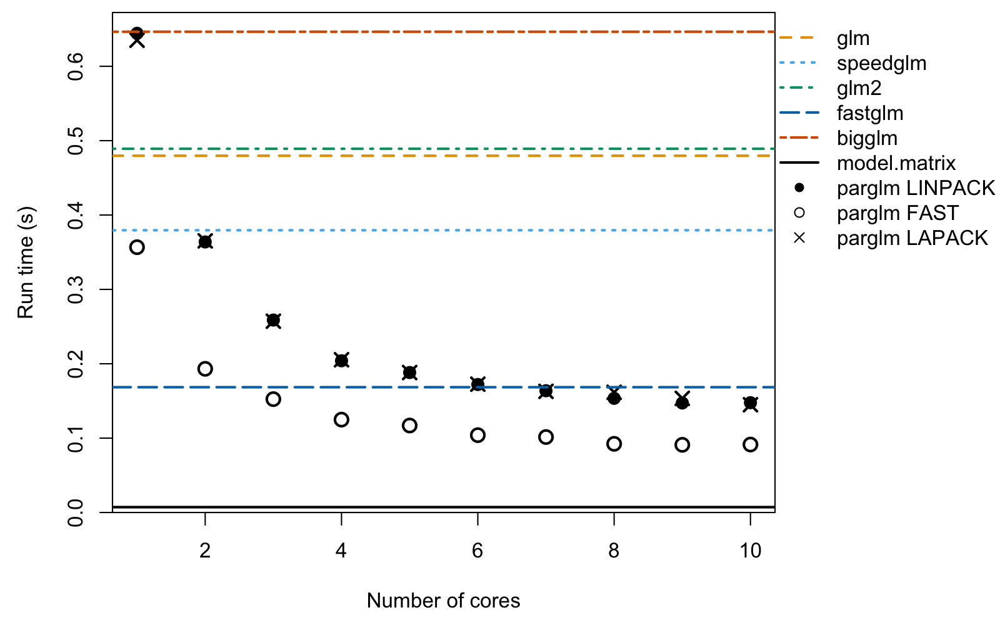
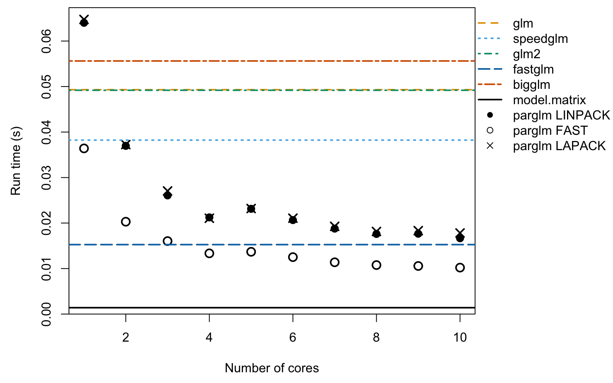
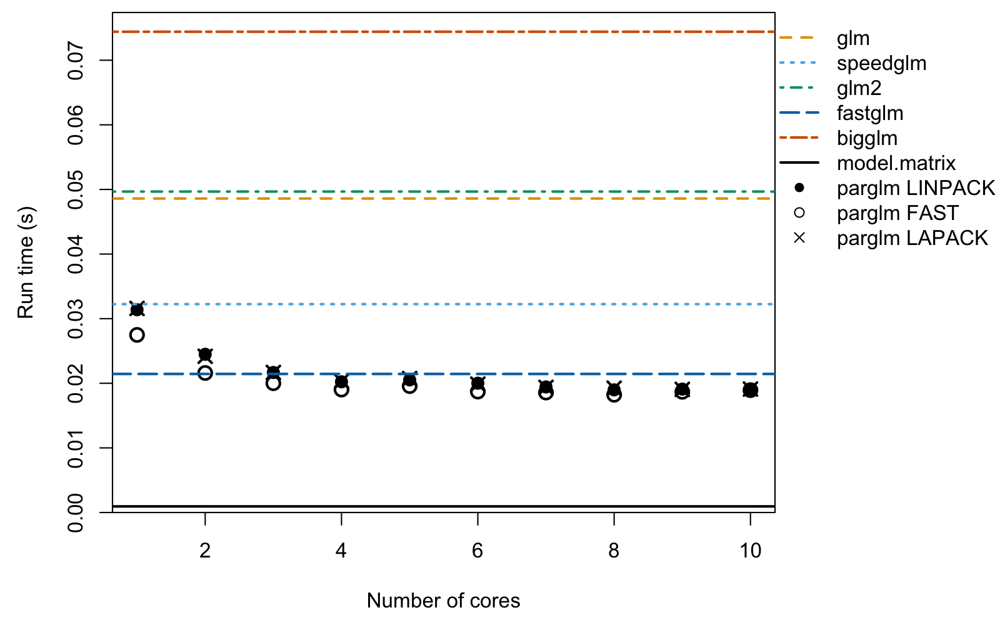

The motivation for the `parglm` package is a parallel version of the `glm`
function. It solves the iteratively re-weighted least squares using a QR
decomposition with column pivoting with `DGEQP3` function from LAPACK.
The computation is done in parallel as in the `bam` function in the `mgcv` package. The
cost is an additional $O(Mp^2 + p^3)$ where $p$ is the number of
coefficients and $M$ is the number chunks to be computed in parallel.
The advantage is that you do not need to compile the package with
an optimized BLAS or LAPACK which supports multithreading. The package also
includes a method that computes the Fisher information and then solves the normal
equation as in the `speedglm` package. This is faster but less numerically
stable.

## Example of computation time


Below, we perform estimate a logistic regression with 1000000 observations
and 50 covariates. We vary the number of cores being used with the
`nthreads` argument to `parglm.control`. The `method` argument sets which
method is used. `LINPACK` uses the same pivoted QR (`dqrdc2`) as `glm.fit`
for the final decomposition; `LAPACK` uses `DGEQP3` from LAPACK throughout;
and `FAST` solves the normal equations from the Fisher information, similar
to the `speedglm` package.


``` r
#####
# simulate
n # number of observations
#> [1] 1000000
p # number of covariates
#> [1] 50
set.seed(68024947)
X <- matrix(rnorm(n * p, 1/p, 1/sqrt(p)), n, ncol = p)
df <- data.frame(y = 1/(1 + exp(-(rowSums(X) - 1))) > runif(n), X)
```


``` r
#####
# compute and measure time. Setup call to make
library(microbenchmark)
library(speedglm)
library(fastglm)
library(glm2)
library(biglm)
library(mgcv)
library(parglm)
X_mat <- model.matrix(y ~ ., df)
biglm_form <- reformulate(names(df)[-1], response = "y")
bam_form   <- biglm_form
cl <- list(
  quote(microbenchmark),
  glm      = quote(glm     (y ~ ., binomial(), df)),
  speedglm = quote(speedglm(y ~ ., family = binomial(), data = df)),
  glm2     = quote(glm2    (y ~ ., binomial(), df)),
  fastglm  = quote(fastglm (X_mat, as.numeric(df$y), family = binomial())),
  bigglm   = quote(bigglm  (biglm_form, df, family = binomial())),
  bam      = quote(bam     (bam_form, family = binomial(), data = df)),
  times = 11L)
tfunc <- function(method = "LINPACK", nthreads)
  parglm(y ~ ., binomial(), df, control = parglm.control(method = method,
                                                         nthreads = nthreads))
cl <- c(
  cl, lapply(1:n_threads, function(i) bquote(tfunc(nthreads = .(i)))))
names(cl)[9:(9L + n_threads - 1L)] <- paste0("parglm-LINPACK-", 1:n_threads)

cl <- c(
  cl, lapply(1:n_threads, function(i) bquote(tfunc(
    nthreads = .(i), method = "FAST"))))
names(cl)[(9L + n_threads):(9L + 2L * n_threads - 1L)] <-
  paste0("parglm-FAST-", 1:n_threads)

cl <- c(
  cl, lapply(1:n_threads, function(i) bquote(tfunc(
    nthreads = .(i), method = "LAPACK"))))
names(cl)[(9L + 2L * n_threads):(9L + 3L * n_threads - 1L)] <-
  paste0("parglm-LAPACK-", 1:n_threads)

cl <- as.call(cl)
cl # the call we make
#> microbenchmark(glm = glm(y ~ ., binomial(), df), speedglm = speedglm(y ~ 
#>     ., family = binomial(), data = df), glm2 = glm2(y ~ ., binomial(), 
#>     df), fastglm = fastglm(X_mat, as.numeric(df$y), family = binomial()), 
#>     bigglm = bigglm(biglm_form, df, family = binomial()), bam = bam(bam_form, 
#>         family = binomial(), data = df), times = 11L, `parglm-LINPACK-1` = tfunc(nthreads = 1L), 
#>     `parglm-LINPACK-2` = tfunc(nthreads = 2L), `parglm-LINPACK-3` = tfunc(nthreads = 3L), 
#>     `parglm-LINPACK-4` = tfunc(nthreads = 4L), `parglm-LINPACK-5` = tfunc(nthreads = 5L), 
#>     `parglm-LINPACK-6` = tfunc(nthreads = 6L), `parglm-LINPACK-7` = tfunc(nthreads = 7L), 
#>     `parglm-LINPACK-8` = tfunc(nthreads = 8L), `parglm-LINPACK-9` = tfunc(nthreads = 9L), 
#>     `parglm-LINPACK-10` = tfunc(nthreads = 10L), `parglm-FAST-1` = tfunc(nthreads = 1L, 
#>         method = "FAST"), `parglm-FAST-2` = tfunc(nthreads = 2L, 
#>         method = "FAST"), `parglm-FAST-3` = tfunc(nthreads = 3L, 
#>         method = "FAST"), `parglm-FAST-4` = tfunc(nthreads = 4L, 
#>         method = "FAST"), `parglm-FAST-5` = tfunc(nthreads = 5L, 
#>         method = "FAST"), `parglm-FAST-6` = tfunc(nthreads = 6L, 
#>         method = "FAST"), `parglm-FAST-7` = tfunc(nthreads = 7L, 
#>         method = "FAST"), `parglm-FAST-8` = tfunc(nthreads = 8L, 
#>         method = "FAST"), `parglm-FAST-9` = tfunc(nthreads = 9L, 
#>         method = "FAST"), `parglm-FAST-10` = tfunc(nthreads = 10L, 
#>         method = "FAST"), `parglm-LAPACK-1` = tfunc(nthreads = 1L, 
#>         method = "LAPACK"), `parglm-LAPACK-2` = tfunc(nthreads = 2L, 
#>         method = "LAPACK"), `parglm-LAPACK-3` = tfunc(nthreads = 3L, 
#>         method = "LAPACK"), `parglm-LAPACK-4` = tfunc(nthreads = 4L, 
#>         method = "LAPACK"), `parglm-LAPACK-5` = tfunc(nthreads = 5L, 
#>         method = "LAPACK"), `parglm-LAPACK-6` = tfunc(nthreads = 6L, 
#>         method = "LAPACK"), `parglm-LAPACK-7` = tfunc(nthreads = 7L, 
#>         method = "LAPACK"), `parglm-LAPACK-8` = tfunc(nthreads = 8L, 
#>         method = "LAPACK"), `parglm-LAPACK-9` = tfunc(nthreads = 9L, 
#>         method = "LAPACK"), `parglm-LAPACK-10` = tfunc(nthreads = 10L, 
#>         method = "LAPACK"))

out <- eval(cl)
```


``` r
s <- summary(out) # result from `microbenchmark`
print(s[, c("expr", "min", "mean", "median", "max")], digits  = 3,
      row.names	= FALSE)
#>               expr   min  mean median   max
#>                glm  5473  5642   5561  6010
#>           speedglm  4021  4172   4151  4365
#>               glm2  5526  5838   5663  6868
#>            fastglm  1977  2221   2186  2642
#>             bigglm  6585  7076   7061  7663
#>                bam 12198 12637  12669 13209
#>   parglm-LINPACK-1  6718  7079   7094  7397
#>   parglm-LINPACK-2  3878  4155   4130  4864
#>   parglm-LINPACK-3  2836  3053   3016  3303
#>   parglm-LINPACK-4  2446  2585   2559  2786
#>   parglm-LINPACK-5  2138  2251   2219  2538
#>   parglm-LINPACK-6  1954  2177   2222  2553
#>   parglm-LINPACK-7  1866  2082   1976  2446
#>   parglm-LINPACK-8  1825  2000   1992  2193
#>   parglm-LINPACK-9  1906  2050   1969  2382
#>  parglm-LINPACK-10  1842  1954   1920  2186
#>      parglm-FAST-1  3871  4017   4010  4321
#>      parglm-FAST-2  1994  2282   2285  2595
#>      parglm-FAST-3  1573  1780   1681  2479
#>      parglm-FAST-4  1258  1388   1360  1519
#>      parglm-FAST-5  1161  1262   1243  1499
#>      parglm-FAST-6  1080  1180   1182  1344
#>      parglm-FAST-7   996  1129   1027  1577
#>      parglm-FAST-8   909  1072   1001  1592
#>      parglm-FAST-9   883  1014   1021  1128
#>     parglm-FAST-10   926  1092   1049  1478
#>    parglm-LAPACK-1  7041  7245   7174  7585
#>    parglm-LAPACK-2  3940  4079   4048  4428
#>    parglm-LAPACK-3  2898  3074   3007  3543
#>    parglm-LAPACK-4  2454  2601   2602  2811
#>    parglm-LAPACK-5  2109  2290   2226  2700
#>    parglm-LAPACK-6  1973  2169   2096  2887
#>    parglm-LAPACK-7  1882  2135   2089  2476
#>    parglm-LAPACK-8  1810  2019   1986  2545
#>    parglm-LAPACK-9  1828  2016   2019  2265
#>   parglm-LAPACK-10  1808  1940   1909  2120
```

The plot below shows median run times versus the number of cores. Coloured
horizontal lines show the single-threaded reference times for `glm`, `speedglm`,
`glm2`, `fastglm`, `bigglm`, and `bam`. We could have used `glm.fit` and
`parglm.fit`. This would make the relative difference bigger as both call e.g.,
`model.matrix` and `model.frame` which do take some time. To show this point, we
first compute how much time this takes and then we make the plot. The black solid
line is the computation time of `model.matrix` and `model.frame`.


``` r
modmat_time <- microbenchmark(
  modmat_time = {
    mf <- model.frame(y ~ ., df); model.matrix(terms(mf), mf)
  }, times = 10)
modmat_time # time taken by `model.matrix` and `model.frame`
#> Unit: milliseconds
#>         expr       min        lq        mean    median         uq        max neval
#>  modmat_time 75.901045 87.949182 115.3905681 92.080219 151.871749 204.918779    10
```


``` r
par(mar = c(4.5, 4.5, .5, 9))
o <- aggregate(time ~ expr, out, median)[, 2] / 10^9
ylim <- range(o, 0); ylim[2] <- ylim[2] + .04 * diff(ylim)

o_linpack <- o[7L:(n_threads + 6L)]
o_fast    <- o[(n_threads + 7L):(2L * n_threads + 6L)]
o_lapack  <- o[(2L * n_threads + 7L):(3L * n_threads + 6L)]

ref_cols <- c("#E69F00", "#56B4E9", "#009E73", "#0072B2", "#D55E00", "#CC79A7")
ref_lty  <- c("dashed", "dotted", "dotdash", "longdash", "twodash", "1373")

plot(1:n_threads, o_linpack, xlab = "Number of cores", yaxs = "i",
     ylim = ylim, ylab = "Run time (s)", pch = 16, cex = 1.4)
points(1:n_threads, o_fast,   pch = 1, cex = 1.4, lwd = 2)
points(1:n_threads, o_lapack, pch = 4, cex = 1.4, lwd = 2)
for (i in 1:6)
  abline(h = o[i], lty = ref_lty[i], col = ref_cols[i], lwd = 2)
abline(h = median(modmat_time$time) / 10^9, lty = "solid", col = "black",
       lwd = 2)
usr <- par("usr")
par(xpd = TRUE)
legend(x = usr[2], y = usr[4], xjust = 0, yjust = 1,
       legend = c("glm", "speedglm", "glm2", "fastglm", "bigglm", "bam",
                  "model.matrix", "parglm LINPACK", "parglm FAST",
                  "parglm LAPACK"),
       lty = c(ref_lty, "solid", NA, NA, NA),
       lwd = c(2, 2, 2, 2, 2, 2, 2, NA, NA, NA),
       col = c(ref_cols, "black", "black", "black", "black"),
       pch = c(NA, NA, NA, NA, NA, NA, NA, 16, 1, 4),
       bty = "n")
```

<div class="figure" style="text-align: center">

<p class="caption">Plot of runtime versus number of cores.</p>
</div>

The open circles are the `FAST` method and the filled circles are the `LINPACK`
method. The `FAST` method, `speedglm`, and `fastglm` all compute the Fisher
information and solve the normal equation.
This is advantages in terms of computation cost but may lead to unstable
solutions. You can alter the number of observations in each parallel chunk
with the `block_size` argument of `parglm.control`.

The single threaded performance of `parglm` may be slower when there are more coefficients.
The cause seems to be the difference between the LAPACK and LINPACK implementation.
This presumably due to either the QR decomposition method and/or the `qr.qty` method.
On Windows, the `parglm` do seems slower when build with `Rtools` and the reason
seems so be the `qr.qty` method in LAPACK, `dormqr`, which is slower then the
LINPACK method, `dqrsl`. Below is an illustration of the
computation times on this machine.


``` r
qr1 <- qr(X)
qr2 <- qr(X, LAPACK = TRUE)
microbenchmark::microbenchmark(
  `qr LINPACK`     = qr(X),
  `qr LAPACK`      = qr(X, LAPACK = TRUE),
  `qr.qty LINPACK` = qr.qty(qr1, df$y),
  `qr.qty LAPACK`  = qr.qty(qr2, df$y),
  times = 11)
#> Unit: milliseconds
#>            expr         min           lq         mean      median           uq
#>      qr LINPACK 1210.613355 1233.6329690 1305.5175198 1295.412958 1371.0355515
#>       qr LAPACK 1375.848316 1389.2720645 1454.8008717 1400.265251 1473.0613045
#>  qr.qty LINPACK   78.596262   80.7090945  208.7720708  133.422364  276.6767945
#>   qr.qty LAPACK  549.984865  552.9238065  584.0375455  558.847712  585.2843685
#>          max neval
#>  1461.413676    11
#>  1818.412689    11
#>   533.635295    11
#>   732.217237    11
```

## Smaller datasets

For smaller datasets the per-call overhead of `parglm`'s thread pool can
exceed the gains from parallelism. Below we repeat the benchmark for
`n = 100,000` and `n = 10,000`, dropping `bam` since it is aimed at much
larger problems. Note the default `block_size` of `parglm.control` is
`10000`, so when `n = 10,000` the work cannot be split further across
threads and `parglm` effectively runs single-threaded regardless of
`nthreads`.


### n = 100,000


``` r
invisible(run_and_plot(n = 100000L, p = 50L, n_threads = n_threads))
#>               expr   min  mean median max
#>                glm 473.7 487.2  479.7 524
#>           speedglm 373.5 383.5  379.5 408
#>               glm2 478.3 496.0  489.1 582
#>            fastglm 156.0 167.3  168.5 176
#>             bigglm 634.2 655.8  646.5 713
#>   parglm-LINPACK-1 624.8 639.1  644.3 660
#>   parglm-LINPACK-2 363.0 365.2  363.8 376
#>   parglm-LINPACK-3 255.7 258.6  258.8 261
#>   parglm-LINPACK-4 201.6 205.3  204.0 217
#>   parglm-LINPACK-5 181.7 189.8  188.2 200
#>   parglm-LINPACK-6 169.4 173.4  172.1 182
#>   parglm-LINPACK-7 157.5 162.8  163.7 169
#>   parglm-LINPACK-8 149.0 154.0  153.5 165
#>   parglm-LINPACK-9 143.3 148.3  147.2 154
#>  parglm-LINPACK-10 142.3 150.6  147.7 162
#>      parglm-FAST-1 353.0 358.5  356.8 375
#>      parglm-FAST-2 190.9 195.4  193.2 201
#>      parglm-FAST-3 150.3 152.7  152.4 156
#>      parglm-FAST-4 120.7 124.6  124.9 129
#>      parglm-FAST-5 112.8 117.1  117.0 122
#>      parglm-FAST-6 100.7 104.6  104.0 111
#>      parglm-FAST-7  96.2 101.3  101.5 104
#>      parglm-FAST-8  88.5  93.1   92.4 102
#>      parglm-FAST-9  86.5  92.1   91.0 103
#>     parglm-FAST-10  85.8  91.3   91.4 102
#>    parglm-LAPACK-1 627.1 648.2  635.1 733
#>    parglm-LAPACK-2 362.0 367.7  365.3 376
#>    parglm-LAPACK-3 254.8 259.0  257.2 279
#>    parglm-LAPACK-4 203.0 207.0  205.4 213
#>    parglm-LAPACK-5 184.0 193.9  188.2 226
#>    parglm-LAPACK-6 168.5 174.9  172.6 186
#>    parglm-LAPACK-7 157.8 172.3  162.9 243
#>    parglm-LAPACK-8 145.3 159.5  161.6 178
#>    parglm-LAPACK-9 144.8 153.6  153.5 162
#>   parglm-LAPACK-10 142.0 147.2  144.9 156
```

<div class="figure" style="text-align: center">

<p class="caption">Plot of runtime versus number of cores for n = 100,000.</p>
</div>

### n = 10,000


``` r
invisible(run_and_plot(n = 10000L, p = 50L, n_threads = n_threads))
#>               expr   min mean median   max
#>                glm 48.35 52.5   49.3  81.9
#>           speedglm 37.92 39.2   38.2  42.5
#>               glm2 48.68 49.7   49.2  52.1
#>            fastglm 15.01 15.4   15.3  16.4
#>             bigglm 53.23 56.3   55.6  65.0
#>   parglm-LINPACK-1 63.46 64.7   64.0  67.4
#>   parglm-LINPACK-2 36.66 37.2   37.0  38.2
#>   parglm-LINPACK-3 25.89 26.8   26.1  32.2
#>   parglm-LINPACK-4 20.82 21.8   21.2  26.2
#>   parglm-LINPACK-5 22.21 23.7   23.1  26.6
#>   parglm-LINPACK-6 20.42 20.8   20.7  22.3
#>   parglm-LINPACK-7 18.29 18.8   18.8  19.5
#>   parglm-LINPACK-8 16.93 17.7   17.6  19.5
#>   parglm-LINPACK-9 17.38 18.4   17.7  21.8
#>  parglm-LINPACK-10 16.23 16.8   16.7  17.7
#>      parglm-FAST-1 35.99 55.6   36.4 235.0
#>      parglm-FAST-2 19.92 20.5   20.3  23.3
#>      parglm-FAST-3 15.68 16.4   16.0  20.0
#>      parglm-FAST-4 12.78 16.7   13.3  49.2
#>      parglm-FAST-5 13.27 13.6   13.7  13.8
#>      parglm-FAST-6 12.12 12.6   12.5  13.0
#>      parglm-FAST-7 11.08 11.5   11.4  12.1
#>      parglm-FAST-8 10.24 11.5   10.8  18.5
#>      parglm-FAST-9 10.22 10.6   10.6  11.3
#>     parglm-FAST-10  9.68 10.4   10.2  12.7
#>    parglm-LAPACK-1 63.42 65.7   64.7  71.2
#>    parglm-LAPACK-2 36.77 38.0   37.3  42.8
#>    parglm-LAPACK-3 25.99 26.9   27.1  28.1
#>    parglm-LAPACK-4 20.99 21.9   21.1  28.5
#>    parglm-LAPACK-5 22.46 23.2   23.2  23.7
#>    parglm-LAPACK-6 20.83 22.1   21.1  27.8
#>    parglm-LAPACK-7 18.88 23.7   19.3  64.6
#>    parglm-LAPACK-8 17.56 18.9   18.2  20.9
#>    parglm-LAPACK-9 17.82 18.5   18.3  19.9
#>   parglm-LAPACK-10 17.32 18.1   17.8  20.0
```

<div class="figure" style="text-align: center">

<p class="caption">Plot of runtime versus number of cores for n = 10,000.</p>
</div>

## Few coefficients

The parglm cost has an additive $O(Mp^2 + p^3)$ term where $M$ is the
number of chunks. With small $p$ this term is negligible, but the per-row
work also shrinks proportionally to $p^2$, so the thread-pool overhead can
dominate the actual computation. Below we use `n = 100,000` and `p = 5`:
parglm now has $M = 10$ chunks available so threading is engaged, but
each chunk is small enough that the parallel benefit is limited.

### n = 100,000, p = 5


``` r
invisible(run_and_plot(n = 100000L, p = 5L, n_threads = n_threads))
#>               expr  min mean median  max
#>                glm 47.5 50.9   48.6 62.8
#>           speedglm 31.8 33.1   32.3 37.0
#>               glm2 48.9 50.6   49.7 53.9
#>            fastglm 19.7 21.8   21.4 25.4
#>             bigglm 72.3 76.3   74.4 88.0
#>   parglm-LINPACK-1 31.1 31.4   31.4 31.7
#>   parglm-LINPACK-2 23.9 25.1   24.5 28.1
#>   parglm-LINPACK-3 21.2 22.0   21.7 23.9
#>   parglm-LINPACK-4 19.9 20.6   20.2 22.9
#>   parglm-LINPACK-5 20.2 20.6   20.5 21.3
#>   parglm-LINPACK-6 19.6 22.0   20.0 40.7
#>   parglm-LINPACK-7 19.1 20.7   19.4 31.4
#>   parglm-LINPACK-8 18.7 19.0   19.0 19.1
#>   parglm-LINPACK-9 18.8 19.4   19.1 21.5
#>  parglm-LINPACK-10 18.5 19.3   18.9 21.6
#>      parglm-FAST-1 27.2 27.9   27.5 31.6
#>      parglm-FAST-2 21.2 22.2   21.6 27.6
#>      parglm-FAST-3 19.9 20.5   20.0 22.2
#>      parglm-FAST-4 18.8 19.9   19.0 22.7
#>      parglm-FAST-5 19.2 20.2   19.6 22.2
#>      parglm-FAST-6 18.4 19.1   18.7 20.8
#>      parglm-FAST-7 18.2 19.1   18.6 21.7
#>      parglm-FAST-8 18.0 18.3   18.2 19.7
#>      parglm-FAST-9 18.1 19.4   18.7 22.3
#>     parglm-FAST-10 17.9 19.9   18.9 25.6
#>    parglm-LAPACK-1 31.1 32.2   31.6 36.9
#>    parglm-LAPACK-2 23.9 25.7   24.2 40.0
#>    parglm-LAPACK-3 21.4 22.0   21.7 24.0
#>    parglm-LAPACK-4 19.8 20.9   20.3 24.9
#>    parglm-LAPACK-5 20.3 21.7   20.7 25.4
#>    parglm-LAPACK-6 19.5 20.1   19.9 21.7
#>    parglm-LAPACK-7 19.0 19.4   19.4 19.8
#>    parglm-LAPACK-8 18.7 20.1   19.2 23.1
#>    parglm-LAPACK-9 18.8 19.5   19.1 24.1
#>   parglm-LAPACK-10 18.7 19.5   19.1 22.2
```

<div class="figure" style="text-align: center">

<p class="caption">Plot of runtime versus number of cores for n = 100,000 and p = 5.</p>
</div>

## Session info


``` r
sessionInfo()
#> R version 4.6.0 (2026-04-24)
#> Platform: aarch64-apple-darwin23
#> Running under: macOS Tahoe 26.4.1
#> 
#> Matrix products: default
#> BLAS:   /System/Library/Frameworks/Accelerate.framework/Versions/A/Frameworks/vecLib.framework/Versions/A/libBLAS.dylib 
#> LAPACK: /Library/Frameworks/R.framework/Versions/4.6/Resources/lib/libRlapack.dylib;  LAPACK version 3.12.1
#> 
#> locale:
#> [1] en_US.UTF-8/en_US.UTF-8/en_US.UTF-8/C/en_US.UTF-8/en_US.UTF-8
#> 
#> time zone: Europe/London
#> tzcode source: internal
#> 
#> attached base packages:
#> [1] grid      stats     graphics  grDevices utils     datasets  methods   base     
#> 
#> other attached packages:
#>  [1] parglm_0.1.8.9000    mgcv_1.9-4           nlme_3.1-169         glm2_1.2.1          
#>  [5] fastglm_0.0.4        bigmemory_4.6.4      speedglm_0.3-5       biglm_0.9-3         
#>  [9] DBI_1.3.0            MASS_7.3-65          Matrix_1.7-5         microbenchmark_1.5.0
#> 
#> loaded via a namespace (and not attached):
#>  [1] digest_0.6.39       codetools_0.2-20    xfun_0.57           lattice_0.22-9     
#>  [5] splines_4.6.0       knitr_1.51          parallel_4.6.0      cli_3.6.6          
#>  [9] compiler_4.6.0      bigmemory.sri_0.1.8 rstudioapi_0.18.0   tools_4.6.0        
#> [13] evaluate_1.0.5      Rcpp_1.1.1-1.1      otel_0.2.0          rlang_1.2.0        
#> [17] uuid_1.2-2
```
